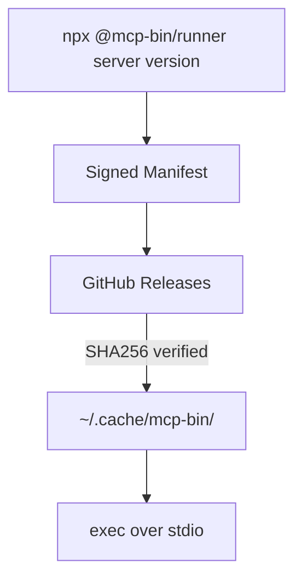

# mcp-bin

A generic runner for distributing prebuilt native MCP servers through Kiro's npm-based MCP registry.

## The Problem

Kiro's MCP registry supports `npm`, `pypi`, and `oci` packages — but not compiled binaries from languages like Rust, Go, or C++. Server authors have to rely on manual installation, which doesn't integrate with enterprise registry allowlists or provide automatic versioning and caching.

## How It Works



1. **Runner** (`@mcp-bin/runner`) — downloads, verifies, caches, and executes native binaries
2. **Manifest** — Ed25519-signed JSON mapping `{server, version, platform}` → download URL + SHA256
3. **Server binaries** — prebuilt `.tar.gz` archives on GitHub Releases

## Install

```
npm install -g @mcp-bin/runner
```

Or use directly via npx (no install needed):

```
npx @mcp-bin/runner <server-name> <version>
```

## Usage

### In a Kiro/MCP agent config

```json
{
  "mcpServers": {
    "local-memory-mcp": {
      "command": "npx",
      "args": ["-y", "@mcp-bin/runner", "local-memory-mcp", "0.2.1"]
    }
  }
}
```

First run downloads the binary (~5s). Subsequent runs use the cache (<100ms).

### In a Kiro enterprise MCP registry

```json
{
  "server": {
    "name": "local-memory-mcp",
    "packages": [{
      "registryType": "npm",
      "identifier": "@mcp-bin/runner",
      "transport": { "type": "stdio" },
      "packageArguments": [
        { "type": "positional", "value": "local-memory-mcp" },
        { "type": "positional", "value": "0.2.1" }
      ]
    }]
  }
}
```

## Security

- **Ed25519 manifest signing** — public key pinned in the package; manifest cannot be tampered with
- **SHA256 archive verification** — every download is verified before extraction
- **Path traversal protection** — archives with `..` paths or symlinks are rejected
- **HTTPS-only downloads** — no plaintext HTTP
- **Env var filtering** — sensitive variables (`AWS_*`, `GITHUB_TOKEN`, `*_SECRET`, `*_KEY`, `*_PASSWORD`) are stripped before spawning the binary
- **Atomic cache writes** — no partial state on crash or concurrent access
- **File-based locking** — concurrent invocations don't corrupt the cache

## Configuration

| Environment Variable | Description | Default |
|---|---|---|
| `MCP_BIN_MANIFEST_URL` | Manifest JSON URL | `https://your-registry.example.com/manifest.json` |
| `MCP_BIN_CACHE_DIR` | Local cache directory | `~/.cache/mcp-bin` |
| `MCP_BIN_ALLOW_ENV` | Comma-separated env vars to pass through denylist | (none) |
| `MCP_BIN_DEBUG` | Set to `1` for debug logging | (none) |
| `MCP_BIN_CHECK` | Set to `1` for diagnostic mode (no exec) | (none) |

## Platforms

- `darwin-arm64` (macOS Apple Silicon)
- `linux-x64`
- `linux-arm64`

## For Server Authors

Add your server to the manifest after a release:

```bash
./update-manifest.sh \
  --server my-server \
  --version 1.0.0 \
  --release-url https://github.com/you/my-server/releases/download/v1.0.0 \
  --checksums https://github.com/you/my-server/releases/download/v1.0.0/SHA256SUMS.txt

./sign-manifest.sh manifest.json
```

### Manifest Format

```json
{
  "schema_version": 1,
  "servers": {
    "my-server": {
      "1.0.0": {
        "darwin-arm64": {
          "url": "https://github.com/you/my-server/releases/download/v1.0.0/my-server-darwin-arm64.tar.gz",
          "sha256": "abc123...",
          "binary_name": "my-server"
        }
      }
    }
  }
}
```

## Development

```bash
npm ci
npx tsc --noEmit          # type check
node --import tsx --test tests/*.test.ts  # run all 48 tests
```

## How This Package Was Built

See [HOW_I_DEVELOPED_THIS_PACKAGE.md](HOW_I_DEVELOPED_THIS_PACKAGE.md) for a detailed writeup of the spec-driven, multi-agent development process used to build this package from scratch in a single day.

## License

MIT
