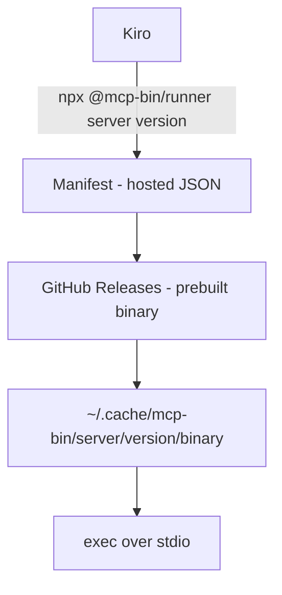

# mcp-bin

A generic runner for distributing prebuilt native MCP servers through Kiro's npm-based MCP registry.

## The Problem

Kiro's MCP registry supports `npm`, `pypi`, and `oci` packages — but not compiled binaries from languages like Rust, Go, or C++. Server authors have to rely on manual installation, which doesn't integrate with enterprise registry allowlists or provide automatic versioning and caching.

## How It Works

`mcp-bin` bridges this gap with three pieces:

1. **Runner** (`@mcp-bin/runner`) — a thin npm package that downloads, caches, and executes native binaries
2. **Manifest** — a static JSON file mapping `{server, version, platform}` → download URL + SHA256 checksum
3. **Server binaries** — prebuilt and published to GitHub Releases by server authors (no change to their workflow)



## Usage

### In a Kiro agent config

```json
{
  "mcpServers": {
    "local-memory-mcp": {
      "command": "npx",
      "args": ["-y", "@mcp-bin/runner", "local-memory-mcp", "0.2.1"]
    }
  }
}
```

### In a Kiro enterprise MCP registry

```json
{
  "server": {
    "name": "local-memory-mcp",
    "description": "Local agent memory MCP server",
    "version": "0.2.1",
    "packages": [{
      "registryType": "npm",
      "identifier": "@mcp-bin/runner",
      "transport": { "type": "stdio" },
      "packageArguments": [
        { "type": "positional", "value": "local-memory-mcp" },
        { "type": "positional", "value": "0.2.1" }
      ]
    }]
  }
}
```

## Manifest Format

```json
{
  "servers": {
    "local-memory-mcp": {
      "0.2.1": {
        "darwin-arm64": {
          "url": "https://github.com/chriswessells/local-memory-mcp/releases/download/v0.2.1/local-memory-mcp-aarch64-apple-darwin.tar.gz",
          "sha256": "abc123..."
        },
        "linux-x64": {
          "url": "https://github.com/chriswessells/local-memory-mcp/releases/download/v0.2.1/local-memory-mcp-x86_64-unknown-linux-gnu.tar.gz",
          "sha256": "def456..."
        }
      }
    }
  }
}
```

## Configuration

| Environment Variable | Description | Default |
|---|---|---|
| `MCP_BIN_MANIFEST_URL` | URL of the manifest JSON | (built-in default) |
| `MCP_BIN_CACHE_DIR` | Local cache directory | `~/.cache/mcp-bin` |

## Project Structure

```
mcp-bin/
├── spec/
│   └── requirements.md    # Full requirements specification
├── runner/                 # @mcp-bin/runner npm package (TODO)
├── manifest/               # Manifest schema and tooling (TODO)
└── README.md
```

## Status

🚧 **Design phase** — see [spec/requirements.md](spec/requirements.md) for the full specification.

## License

MIT
