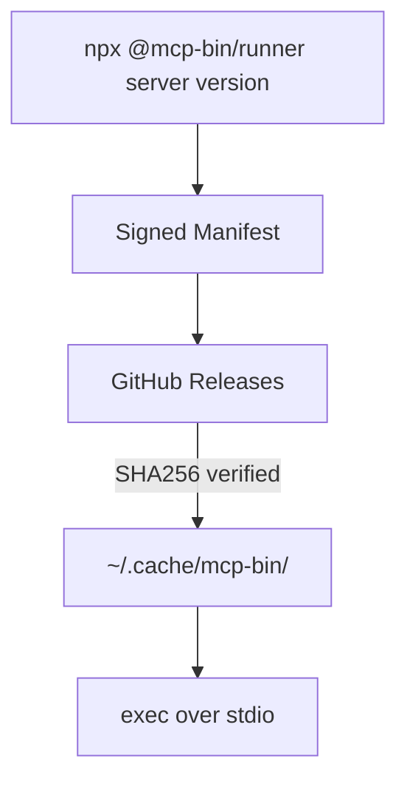

# mcp-bin

A generic runner for distributing prebuilt native MCP servers through Kiro's npm-based MCP registry.

## The Problem

Kiro's MCP registry supports `npm`, `pypi`, and `oci` packages — but not compiled binaries from languages like Rust, Go, or C++. Server authors have to rely on manual installation, which doesn't integrate with enterprise registry allowlists or provide automatic versioning and caching.

## How It Works



1. **Runner** (`@mcp-bin/runner`) — downloads, verifies, caches, and executes native binaries
2. **Manifest** — Ed25519-signed JSON mapping `{server, version, platform}` → download URL + SHA256
3. **Server binaries** — prebuilt `.tar.gz` archives on GitHub Releases

## Install

```
npm install -g @mcp-bin/runner
```

Or use directly via npx (no install needed):

```
npx @mcp-bin/runner <server-name> <version>
```

## Usage

### In a Kiro/MCP agent config

```json
{
  "mcpServers": {
    "local-memory-mcp": {
      "command": "npx",
      "args": ["-y", "@mcp-bin/runner", "local-memory-mcp", "0.2.1"]
    }
  }
}
```

First run downloads the binary (~5s). Subsequent runs use the cache (<100ms).

### In a Kiro enterprise MCP registry

```json
{
  "server": {
    "name": "local-memory-mcp",
    "packages": [{
      "registryType": "npm",
      "identifier": "@mcp-bin/runner",
      "transport": { "type": "stdio" },
      "packageArguments": [
        { "type": "positional", "value": "local-memory-mcp" },
        { "type": "positional", "value": "0.2.1" }
      ]
    }]
  }
}
```

## Security

- **Ed25519 manifest signing** — public key pinned in the package; manifest cannot be tampered with
- **SHA256 archive verification** — every download is verified before extraction
- **Path traversal protection** — archives with `..` paths or symlinks are rejected
- **HTTPS-only downloads** — no plaintext HTTP
- **Env var filtering** — sensitive variables (`AWS_*`, `GITHUB_TOKEN`, `*_SECRET`, `*_KEY`, `*_PASSWORD`) are stripped before spawning the binary
- **Atomic cache writes** — no partial state on crash or concurrent access
- **File-based locking** — concurrent invocations don't corrupt the cache

## Why mcp-bin?

**vs. Docker:** Lighter weight, no container runtime required, native performance, simpler configuration in MCP client settings.

**vs. cargo-binstall:** Works for any compiled language (Go, Rust, C++, Zig), integrates with MCP registries, signed manifests for supply-chain security.

**vs. manual install scripts:** Automatic caching, version management, SHA256 checksum verification, cross-platform detection, Ed25519 manifest signing.

## Configuration

| Environment Variable | Description | Default |
|---|---|---|
| `MCP_BIN_MANIFEST_URL` | Manifest JSON URL | `https://your-registry.example.com/manifest.json` |
| `MCP_BIN_CACHE_DIR` | Local cache directory | `~/.cache/mcp-bin` |
| `MCP_BIN_ALLOW_ENV` | Comma-separated env vars to pass through denylist | (none) |
| `MCP_BIN_DEBUG` | Set to `1` for debug logging | (none) |
| `MCP_BIN_CHECK` | Set to `1` for diagnostic mode (no exec) | (none) |
| `MCP_BIN_PUBLIC_KEY` | Base64-encoded Ed25519 DER SPKI public key for manifest verification | (hardcoded default) |
| `MCP_BIN_CACHE_MAX_VERSIONS` | Max cached versions per server (0 = unlimited) | `5` |
| `MCP_BIN_VERBOSE` | Set to `1` for verbose logging (includes debug output) | (none) |

## Self-Hosting

Run your own mcp-bin registry — no fork required.

### Quickstart

1. **Generate an Ed25519 signing key:**
   ```bash
   openssl genpkey -algorithm ed25519 -out signing-key.pem
   ```

2. **Extract the base64 DER SPKI public key:**
   ```bash
   openssl pkey -in signing-key.pem -pubout -outform DER | base64 | tr -d '\n'
   ```
   > **Important:** The `tr -d '\n'` is required — most base64 implementations wrap output at 76 characters by default, which breaks the environment variable.

3. **Create your manifest:**
   ```bash
   ./update-manifest.sh \
     --server my-server \
     --version 1.0.0 \
     --release-url https://github.com/you/my-server/releases/download/v1.0.0 \
     --checksums https://github.com/you/my-server/releases/download/v1.0.0/SHA256SUMS.txt
   ```

4. **Sign the manifest:**
   ```bash
   ./sign-manifest.sh manifest.json signing-key.pem
   ```

5. **Host `manifest.json` and `manifest.json.sig`** on any HTTPS endpoint (GitHub Pages, S3, any static host).

6. **Configure clients:**
   ```bash
   export MCP_BIN_MANIFEST_URL=https://your-domain.com/manifest.json
   export MCP_BIN_PUBLIC_KEY=<output from step 2>
   ```

### Server Binary Requirements

- Must be an MCP server using stdio transport.
- Must provide `.tar.gz` archives for at least one supported platform (`darwin-arm64`, `linux-x64`, `linux-arm64`).
- Must provide a SHA256SUMS file in the release.
- Binary must be statically linked or bundled with all dependencies.
- Release URLs must be HTTPS.

## Platforms

- `darwin-arm64` (macOS Apple Silicon)
- `linux-x64`
- `linux-arm64`

### WSL2

mcp-bin works under WSL2 using the `linux-x64` platform. No special configuration required.

## For Server Authors

Add your server to the manifest after a release:

```bash
./update-manifest.sh \
  --server my-server \
  --version 1.0.0 \
  --release-url https://github.com/you/my-server/releases/download/v1.0.0 \
  --checksums https://github.com/you/my-server/releases/download/v1.0.0/SHA256SUMS.txt

./sign-manifest.sh manifest.json
```

### Manifest Format

```json
{
  "schema_version": 1,
  "servers": {
    "my-server": {
      "1.0.0": {
        "darwin-arm64": {
          "url": "https://github.com/you/my-server/releases/download/v1.0.0/my-server-darwin-arm64.tar.gz",
          "sha256": "abc123...",
          "binary_name": "my-server"
        }
      }
    }
  }
}
```

## Troubleshooting

### `mcp-bin-runner: command not found` when launching from the project directory

If your MCP host (e.g. Kiro CLI) launches from a directory that contains this project's `package.json`, `npx` resolves `@mcp-bin/runner` to the local source instead of the published npm package. Since the local bin isn't linked, the command isn't found.

Fix by wrapping the call so it runs from a neutral directory:

```json
{
  "local-memory-mcp": {
    "command": "sh",
    "args": ["-c", "cd /tmp && exec npx -y @mcp-bin/runner local-memory-mcp 2.0.1"],
    "env": {
      "MCP_BIN_MANIFEST_URL": "https://mcpregistry.wessells.io/manifest.json"
    }
  }
}
```

## Development

```bash
npm ci
npx tsc --noEmit          # type check
node --import tsx --test tests/*.test.ts  # run all tests
```

## How This Package Was Built

See [HOW_I_DEVELOPED_THIS_PACKAGE.md](HOW_I_DEVELOPED_THIS_PACKAGE.md) for a detailed writeup of the spec-driven, multi-agent development process used to build this package from scratch in a single day.

## License

MIT
