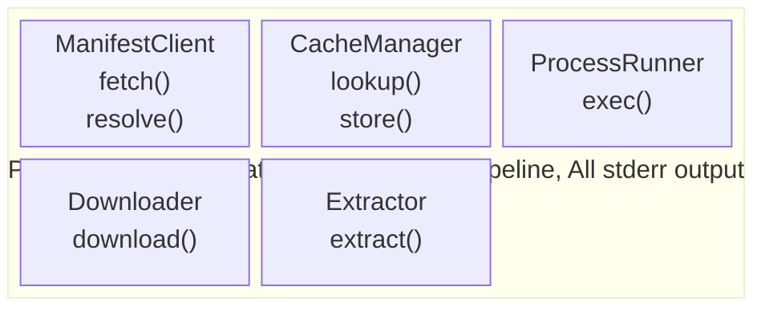

# Architecture — mcp-bin Runner

## Overview

The runner is a single npm package (`@mcp-bin/runner`) that resolves, downloads, caches, and executes native MCP server binaries. It is invoked via `npx` and acts as a transparent shim — once the binary is running, the runner is invisible.

## Component Diagram



## Data Flow

```
1. CLI parses args → (serverName, version, extraArgs)
2. CLI detects platform → platformKey (e.g. "darwin-arm64")
3. ManifestClient.fetch() → Manifest (verified via Ed25519 signature)
4. ManifestClient.resolve(manifest, serverName, version, platform) → ServerEntry { url, sha256, binaryName }
5. CacheManager.lookup(serverName, version, binaryName) → CacheHit { binaryPath } | CacheMiss
6. If CacheMiss:
   a. CacheManager.acquireLock(serverName, version)
   b. Downloader.download(url, sha256, tempDir) → archivePath (verified)
   c. Extractor.extract(archivePath, binaryName, tempDir) → binaryPath (validated)
   d. CacheManager.store(serverName, version, binaryName, binaryPath) → finalBinaryPath
   e. CacheManager.releaseLock(serverName, version)
7. ProcessRunner.exec(binaryPath, extraArgs) → exitCode
8. CLI exits with exitCode
```

## Module Structure

```
src/
  cli.ts              # Entry point, arg parsing, orchestration
  manifest-client.ts  # Manifest fetch, cache, signature verification
  cache-manager.ts    # Cache lookup, atomic store, locking, sidecar verification
  downloader.ts       # HTTP download with retry, timeout, checksum
  extractor.ts        # tar.gz extraction with path traversal protection
  process-runner.ts   # spawn, signal forwarding, env filtering
  platform.ts         # Platform detection (shared utility)
  errors.ts           # Error types and exit codes
  types.ts            # Shared type definitions
```

## Component Boundaries

Each component is a module exporting a single class or a small set of functions. Components communicate through typed interfaces defined in `types.ts`. No component imports another component — the CLI orchestrates all interactions.

| Component | Depends On | Depended On By |
|-----------|-----------|----------------|
| `types.ts` | nothing | all |
| `errors.ts` | nothing | all |
| `platform.ts` | nothing | CLI |
| ManifestClient | types, errors | CLI |
| CacheManager | types, errors | CLI |
| Downloader | types, errors | CLI |
| Extractor | types, errors | CLI |
| ProcessRunner | types, errors | CLI |
| CLI | all of the above | nothing (entry point) |

## Shared Types (`types.ts`)

```typescript
/** Manifest schema as fetched from the registry */
interface Manifest {
  schema_version: number;
  servers: Record<string, Record<string, Record<string, PlatformEntry>>>;
}

interface PlatformEntry {
  url: string;
  sha256: string;
  binary_name?: string;
}

/** Resolved entry for a specific server+version+platform */
interface ServerEntry {
  url: string;
  sha256: string;
  binaryName: string;
}

/** Result of a cache lookup */
type CacheLookupResult =
  | { hit: true; binaryPath: string }
  | { hit: false };

/** Platform identifier */
type Platform = "darwin-arm64" | "linux-x64" | "linux-arm64";
```

## Error Strategy

All components throw typed errors from `errors.ts`. The CLI catches all errors at the top level and writes them to stderr with the appropriate message from E1–E15. No component writes to stdout or stderr directly.

```typescript
class McpBinError extends Error {
  constructor(
    message: string,
    public readonly code: string,
    public readonly exitCode: number = 1
  ) {
    super(message);
  }
}
```

Error codes map 1:1 to the spec error codes (E1–E15). The CLI's catch block formats the message and calls `process.exit(exitCode)`.

Additionally, all components that perform disk writes (Downloader, Extractor, CacheManager) must catch `ENOSPC` errors and throw a `DiskFullError` with message: `"Insufficient disk space in cache directory: <path>"`. The CLI catch-all handles this like any other `McpBinError`.

## Signal Handling

Two phases with different signal behavior:

1. **Download phase** (before spawn): SIGTERM/SIGINT trigger cleanup of temp files, then `process.exit(1)`.
2. **Exec phase** (after spawn): SIGTERM/SIGINT are forwarded to the child process. The runner waits for the child to exit and uses its exit code. No runner output after spawn.

The CLI installs phase-appropriate handlers and switches them when transitioning from download to exec.

## Environment Variable Filtering (S12)

The ProcessRunner strips sensitive env vars before spawning the child. The denylist patterns (ADR-010):

- `AWS_*`
- `GITHUB_TOKEN`
- `*_SECRET`
- `*_KEY`
- `*_PASSWORD`

The Kiro registry's `environmentVariables` array is not available to the runner at runtime — it's consumed by Kiro before invoking npx. The runner applies the denylist unconditionally, with the exception of vars listed in `MCP_BIN_ALLOW_ENV` (ADR-010 amendment).

## URL Sanitization (S11)

A shared utility strips query parameters from URLs before including them in error messages. Used by ManifestClient and Downloader.

## Configuration

All configuration via environment variables (ADR-006):

| Variable | Default | Purpose |
|----------|---------|---------|
| `MCP_BIN_MANIFEST_URL` | `https://chriswessells.github.io/mcp-bin/manifest.json` | Manifest location |
| `MCP_BIN_CACHE_DIR` | `~/.cache/mcp-bin` | Cache root directory |
| `MCP_BIN_ALLOW_ENV` | (none) | Comma-separated env var names to pass through despite denylist (ADR-010 amendment) |
| `MCP_BIN_ALLOW_FILE_PROTOCOL` | (none) | Set to `1` to allow `file://` manifest URLs (dev/test only) |
| `MCP_BIN_DEBUG` | (none) | Set to `1` for debug logging to stderr |
| `MCP_BIN_CHECK` | (none) | Set to `1` for diagnostic mode: verify manifest, signature, cache, platform without executing (ADR-006 amendment) |

## Dependencies

| Package | Purpose | Justification |
|---------|---------|---------------|
| `node:crypto` | SHA256, Ed25519 verify | Built-in, no external dep |
| `node:child_process` | spawn | Built-in |
| `node:fs/promises` | File I/O | Built-in |
| `node:path` | Path manipulation | Built-in |
| `node:os` | Platform detection, homedir | Built-in |
| `node:zlib` | gunzip | Built-in |
| `tar-stream` | Streaming tar extraction | Lightweight, well-maintained, avoids shelling out to `tar`. **Pinned to exact version** (security-critical path). |

Only one external dependency: `tar-stream` for tar extraction. Everything else uses Node.js built-ins. HTTP uses `node:https` (no `fetch` polyfill needed — Node 18+ has global `fetch`, but `node:https` gives finer timeout control).

**Decision**: Use `node:https` for HTTP requests rather than global `fetch`. Rationale: `node:https` provides per-socket connect timeout, response timeout, and abort controller integration that `fetch` does not expose directly. This satisfies R18 (connect timeout 5s, response timeout 30s, download timeout 5min).
