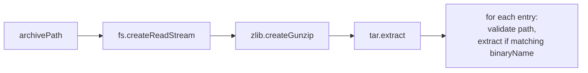

# Component Design — Extractor

## Purpose

Extracts a named binary from a `.tar.gz` archive with path traversal protection and symlink rejection.

## Requirements Covered

R7–R8, S8–S9, E11–E12

## API Contract

```typescript
interface Extractor {
  /**
   * Extract the named binary from a tar.gz archive into destDir.
   * Sets the binary as executable (chmod +x).
   * @param archivePath - Path to the .tar.gz file
   * @param binaryName - Name of the binary to extract (validated against S8)
   * @param destDir - Directory to write the extracted binary
   * @returns Path to the extracted binary
   * @throws InvalidBinaryNameError (E11) — binary_name contains forbidden characters
   * @throws PathTraversalError (E12) — archive contains unsafe paths or symlinks
   * @throws ExtractionError — binary not found in archive or extraction failed
   */
  extract(archivePath: string, binaryName: string, destDir: string): Promise<string>;
}
```

## Internal Design

### Binary Name Validation (S8)

Before touching the archive, validate `binaryName`:

```typescript
function validateBinaryName(name: string): void {
  if (!/^[a-zA-Z0-9_-]+$/.test(name)) {
    throw new InvalidBinaryNameError(name);
  }
}
```

Rejects `/`, `\`, `..`, null bytes, spaces, and any non-alphanumeric/hyphen/underscore characters.

### Extraction Flow

```
1. Validate binaryName (S8)
2. Create gunzip stream from archivePath
3. Pipe through tar-stream extract
4. For each tar entry:
   a. Normalize entry.name (strip leading ./ or /)
   b. Reject if entry is a symlink → throw E12
   c. Resolve full path: path.resolve(destDir, normalizedName)
   d. Verify resolved path starts with destDir + path.sep → throw E12 if not
   e. If basename matches binaryName:
      - Pipe entry data to destDir/binaryName
      - Set found = true
   f. Else: entry.resume() (skip)
5. If !found → throw ExtractionError
6. chmod +x on the extracted binary (fs.chmod(path, 0o755))
7. Return path to extracted binary
```

### Path Traversal Protection (S9)

Three checks on every tar entry:

1. **Symlink rejection**: Any entry with `entry.type === 'symlink'` or `entry.type === 'link'` → throw E12
2. **Component check**: Reject entries where any path component is `..`
3. **Resolve check**: `path.resolve(destDir, name)` must start with `path.resolve(destDir) + path.sep`

The resolve check is the definitive guard — it catches all traversal tricks including encoded characters and redundant separators.

### Streaming Architecture



The archive is never fully loaded into memory. `tar-stream` processes entries one at a time.

### Only Extract the Target Binary

The extractor does not extract the full archive. It streams through entries, extracts only the one matching `binaryName`, and skips everything else. This minimizes disk writes and attack surface.

## Error Types

```typescript
class InvalidBinaryNameError extends McpBinError {
  constructor(name: string) {
    super(
      `Invalid binary name '${name}' in manifest — must contain only alphanumeric characters, hyphens, and underscores.`,
      "E11"
    );
  }
}

class PathTraversalError extends McpBinError {
  constructor() {
    super("Archive contains unsafe paths. Extraction aborted.", "E12");
  }
}

class ExtractionError extends McpBinError {
  constructor(binaryName: string) {
    super(`Binary '${binaryName}' not found in archive`, "EXTRACTION");
  }
}
```

## Testing Notes

- Normal archive: binary extracted, chmod +x set
- Binary name with `/` → E11
- Binary name with `..` → E11
- Binary name with null byte → E11
- Archive with `../../../etc/passwd` entry → E12
- Archive with absolute path `/usr/bin/evil` → E12
- Archive with symlink entry → E12
- Archive missing the target binary → ExtractionError
- Large archive with many files: only target binary extracted
