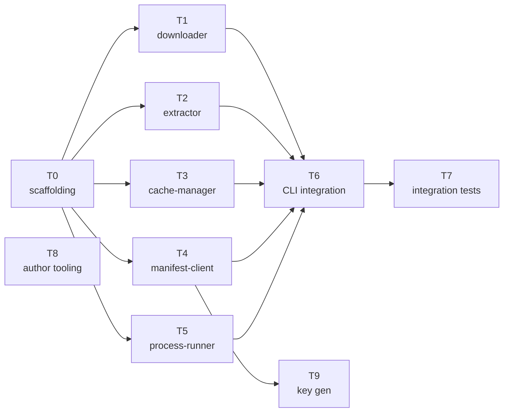

# Implementation Plan — mcp-bin Runner

## Execution Phases

| Phase | Tasks | Mode | Gate |
|-------|-------|------|------|
| 1 | T0 (scaffolding) | Sequential | Build passes (`tsc --noEmit`) |
| 2 | T1, T2, T3, T4, T5 | **Parallel** (5 subagents, sonnet-4.6) | All 5 build + unit tests pass |
| 3 | T6 (CLI integration) | Sequential | Build passes, `node dist/cli.js` runs |
| 4 | T7 (integration tests) | Sequential | All integration tests pass |
| 5 | T9 (key generation) | Sequential (after T4) | Manifest signed and verified |
| — | T8 (author tooling) | Independent, anytime | Script runs idempotently |
| — | T10 (README + docs) | Independent, anytime | README exists with quickstart |

**Critical path**: Phase 1 → Phase 2 → Phase 3 → Phase 4 = **~2h 50min wall-clock**

After Phase 4, per AGENTS.md: Code Review (7 personas) → fix findings → QA testing → complete.

## Task List

### T0: Project Scaffolding
**Estimate**: 20 min
**Depends on**: nothing
**Acceptance criteria**:
- `package.json` with name `@mcp-bin/runner`, TypeScript config, `tar-stream` dependency (exact version `3.1.7`)
- `tsconfig.json` targeting ES2022, Node18, strict mode
- `src/types.ts` and `src/errors.ts` with all shared types and error classes (including InvalidArgumentError, DiskFullError)
- `src/platform.ts` with `detectPlatform()` and `sanitizeUrl()`
- `LICENSE` file (MIT)
- `.github/workflows/ci.yml` (build + test)
- Build succeeds (`tsc --noEmit`)

### T1: Downloader
**Estimate**: 45 min
**Depends on**: T0
**Acceptance criteria**:
- `src/downloader.ts` implements the API contract from `design/downloader.md`
- HTTPS-only enforcement
- Three-layer timeout (connect 5s, response 30s, overall 5min)
- Retry logic: 3 attempts, 1s/2s/4s, transient-only (5xx, TCP reset, TLS)
- No retry on 4xx
- Streaming SHA256 verification after download
- File deleted on checksum mismatch
- All error types: E4, E5, E8, E9
- Unit tests: successful download, 4xx no-retry, 5xx retry, timeout, checksum mismatch

### T2: Extractor
**Estimate**: 30 min
**Depends on**: T0
**Acceptance criteria**:
- `src/extractor.ts` implements the API contract from `design/extractor.md`
- Binary name validation (S8): alphanumeric, hyphens, underscores only
- Path traversal protection (S9): symlink rejection, component check, resolve check
- Streaming extraction via `tar-stream` — only extracts target binary
- `chmod +x` on extracted binary
- All error types: E11, E12
- Unit tests: normal extraction, invalid binary name, path traversal, symlink, missing binary

### T3: Cache Manager
**Estimate**: 45 min
**Depends on**: T0
**Acceptance criteria**:
- `src/cache-manager.ts` implements the API contract from `design/cache-manager.md`
- Lookup with sidecar SHA256 verification
- Atomic store via same-filesystem rename
- File-based locking with PID, 60s wait, 10-min stale break
- Temp directory creation and cleanup
- Error type: E14
- Unit tests: cache hit, cache miss (no file), cache miss (sidecar mismatch), atomic store, lock acquire/release, stale lock break, lock timeout

### T4: Manifest Client
**Estimate**: 45 min
**Depends on**: T0
**Acceptance criteria**:
- `src/manifest-client.ts` implements the API contract from `design/manifest-client.md`
- Fetch manifest + .sig over HTTPS
- Ed25519 signature verification using `node:crypto`
- 1-hour TTL cache with atomic writes
- Fallback to last-known-good on fetch failure
- Schema version check (must be 1)
- Resolve: server → version → platform lookup
- All error types: E1, E2, E3, E6, E10, E13, E15
- Unit tests: fresh fetch, cached fetch, fallback, signature failure, schema version, resolve errors

### T5: Process Runner
**Estimate**: 30 min
**Depends on**: T0
**Acceptance criteria**:
- `src/process-runner.ts` implements the API contract from `design/process-runner.md`
- Env var denylist filtering (AWS_*, GITHUB_TOKEN, *_SECRET, *_KEY, *_PASSWORD, MCP_BIN_*)
- `child_process.spawn` with `stdio: "inherit"`
- SIGTERM/SIGINT forwarding to child
- Exit code propagation (including signal-to-number mapping)
- No stdout/stderr output after spawn
- Unit tests: exit code propagation, signal forwarding, env filtering, extra args

### T6: CLI Integration
**Estimate**: 45 min
**Depends on**: T1, T2, T3, T4, T5
**Acceptance criteria**:
- `src/cli.ts` implements the orchestration from `design/cli.md`
- Argument parsing: server name, version, extra args
- Platform detection
- Full flow: resolve → cache check → lock → re-check → download → extract → store → exec
- Signal handler phase transitions
- Error catch-all with stderr output
- Shebang line in output
- `package.json` bin field configured
- Build succeeds, `node dist/cli.js` runs

### T7: Integration Tests
**Estimate**: 60 min
**Depends on**: T6
**Acceptance criteria**:
- T2 spec: mock manifest + local fixtures → full download/cache/exec cycle
- T3 spec: second run uses cache, no HTTP requests
- T4 spec: tampered archive rejected
- T5 spec: missing platform error
- T6 spec: concurrent invocations don't corrupt cache
- T7 spec: stalled download aborted
- T8 spec: path traversal archive rejected
- T9 spec: invalid binary_name rejected
- T10 spec: stale lock broken
- T11 spec: corrupted cache triggers re-download
- Test binary: simple shell script that echoes args and exits 0

### T8: Author Tooling
**Estimate**: 30 min
**Depends on**: nothing
**Acceptance criteria**:
- `update-manifest.sh` per R31–R34
- Inputs: server name, version, release URL base, checksums URL
- Uses `jq` and `curl`
- Idempotent
- Tested manually with a sample release

### T9: Ed25519 Key Generation & Pinning
**Estimate**: 15 min
**Depends on**: T4
**Acceptance criteria**:
- Generate Ed25519 keypair
- Private key stored securely (not in repo)
- Public key embedded in `src/manifest-client.ts` as DER-encoded SPKI constant
- Script to sign a manifest: `sign-manifest.sh`

## DAG



**Parallel tracks after T0**:
- Track A: T1 (downloader)
- Track B: T2 (extractor)
- Track C: T3 (cache-manager)
- Track D: T4 (manifest-client)
- Track E: T5 (process-runner)
- Track F: T8 (author tooling) — fully independent

**Sequential gates**:
- T6 requires T1–T5 complete
- T7 requires T6 complete
- T9 requires T4 complete

## Subagent Instructions

### Subagent: Scaffolding (T0)

**Model**: sonnet-4.6

**Prompt**:
```
You are implementing the project scaffolding for mcp-bin, an npm package that downloads and runs native MCP server binaries.

Read these design files:
- design/architecture.md
- spec/requirements.md

Create:
1. package.json:
   - name: "@mcp-bin/runner"
   - version: "1.0.0"
   - type: "module"
   - bin: { "mcp-bin-runner": "./dist/cli.js" }
   - engines: { "node": ">=18" }
   - scripts: { "build": "tsc", "test": "node --test" }
   - dependencies: { "tar-stream": "3.1.7" }
   - devDependencies: { "@types/node": "^18", "@types/tar-stream": "^3", "typescript": "^5" }

2. tsconfig.json:
   - target: ES2022, module: Node16, moduleResolution: Node16
   - strict: true, outDir: dist, rootDir: src
   - declaration: true

3. src/types.ts — all interfaces from design/architecture.md "Shared Types" section

4. src/errors.ts — McpBinError base class and sanitizeUrl utility. Error codes E1–E15 as subclasses. Copy exact error messages from spec/requirements.md error handling section. Also add: InvalidArgumentError (for serverName/version validation), DiskFullError (for ENOSPC).

5. src/platform.ts — detectPlatform() returning Platform type. Fail with E3 message for unsupported platforms.

6. LICENSE — MIT license file.

7. .github/workflows/ci.yml — minimal CI: `npm ci && npm run build && npm test`. Runs on push and PR.

Run `npx tsc --noEmit` to verify. Fix any errors before completing.

Track your time. Maintain a todo list.
```

### Subagent: Downloader (T1)

**Model**: sonnet-4.6

**Prompt**:
```
You are implementing the Downloader component for mcp-bin.

Read these design files:
- design/downloader.md
- design/architecture.md
- src/types.ts and src/errors.ts (already created by T0)

Implement src/downloader.ts following the API contract in design/downloader.md exactly.

Key requirements:
- Use node:https for HTTP (not fetch) — gives fine-grained timeout control
- Three timeout layers: connect (5s), response (30s), overall (5min via AbortController)
- Retry: 3 attempts, delays [1000, 2000, 4000]ms, only on 5xx/TCP reset/TLS errors
- No retry on 4xx
- Streaming SHA256 verification after download completes
- Delete file on checksum mismatch
- HTTPS-only enforcement
- URL sanitization in error messages (strip query params)

Write tests in tests/downloader.test.ts using node:test. Focus tests on critical and high-severity paths only — do not write tests for low-likelihood edge cases. Mock HTTP with a local HTTPS server or by mocking the https module. Test:
- Successful download with correct checksum
- 4xx → immediate failure, no retry
- 5xx → 3 retries then E9
- Connect timeout → retry
- Checksum mismatch → file deleted, E5
- Non-HTTPS URL → rejected

Run `npx tsc --noEmit` and `node --test tests/downloader.test.ts`. Fix any errors.

Track your time. Maintain a todo list.
```

### Subagent: Extractor (T2)

**Model**: sonnet-4.6

**Prompt**:
```
You are implementing the Extractor component for mcp-bin.

Read these design files:
- design/extractor.md
- design/architecture.md
- src/types.ts and src/errors.ts (already created by T0)

Implement src/extractor.ts following the API contract in design/extractor.md exactly.

Key requirements:
- Validate binary name: /^[a-zA-Z0-9_-]+$/ — reject anything else with E11
- Streaming extraction via tar-stream: gunzip → tar.extract()
- Only extract the entry matching binaryName, skip all others
- Path traversal protection (3 checks per entry):
  1. Reject symlinks and hard links
  2. Reject entries with ".." path components
  3. path.resolve(destDir, name) must start with path.resolve(destDir) + path.sep
- chmod 0o755 on extracted binary
- Throw ExtractionError if binary not found in archive

Write tests in tests/extractor.test.ts using node:test. Focus tests on critical and high-severity paths only — do not write tests for low-likelihood edge cases. Create test fixtures:
- A valid .tar.gz containing a test binary
- A .tar.gz with a ../evil path
- A .tar.gz with a symlink
Use tar-stream to create these fixtures programmatically in the test setup.

Run `npx tsc --noEmit` and `node --test tests/extractor.test.ts`. Fix any errors.

Track your time. Maintain a todo list.
```

### Subagent: Cache Manager (T3)

**Model**: sonnet-4.6

**Prompt**:
```
You are implementing the CacheManager component for mcp-bin.

Read these design files:
- design/cache-manager.md
- design/architecture.md
- src/types.ts and src/errors.ts (already created by T0)

Implement src/cache-manager.ts following the API contract in design/cache-manager.md exactly.

Key requirements:
- lookup(): check binary exists, check .sha256 sidecar exists, compute SHA256 of binary, compare to sidecar content. Return CacheMiss on any failure.
- store(): compute SHA256 of temp binary, write to temp sidecar, mkdir -p final dir, rename both files atomically
- acquireLock(): O_CREAT|O_EXCL for .lock file, write PID, check stale (dead PID or >10min), wait up to 60s with 1s polling
- releaseLock(): delete .lock, ignore ENOENT
- tempDir(): create {cacheDir}/{server}/{version}/.tmp
- cleanupTemp(): rm -rf the .tmp directory

Write tests in tests/cache-manager.test.ts using node:test. Focus tests on critical and high-severity paths only — do not write tests for low-likelihood edge cases. Use a temp directory for the cache root. Test:
- Cache hit (binary + matching sidecar)
- Cache miss (no binary)
- Cache miss (sidecar mismatch)
- Cache miss (no sidecar)
- Atomic store (files appear at final path)
- Lock acquire and release
- Stale lock (write a lock file with a dead PID, verify it's broken)
- Lock timeout (hold a lock in a subprocess, verify E14 after timeout — use a short timeout for testing)

Run `npx tsc --noEmit` and `node --test tests/cache-manager.test.ts`. Fix any errors.

Track your time. Maintain a todo list.
```

### Subagent: Manifest Client (T4)

**Model**: sonnet-4.6

**Prompt**:
```
You are implementing the ManifestClient component for mcp-bin.

Read these design files:
- design/manifest-client.md
- design/architecture.md
- src/types.ts and src/errors.ts (already created by T0)

Implement src/manifest-client.ts following the API contract in design/manifest-client.md exactly.

Key requirements:
- fetch(): download manifest + .sig, verify Ed25519 signature, cache with 1-hour TTL
- Use node:crypto verify() with Ed25519 key in DER SPKI format
- Cache layout: {cacheDir}/.manifest/manifest.json, manifest.json.sig, manifest.json.meta
- Fallback: on fetch failure, use cached manifest+sig if available (any age), verify sig, warn
- Schema version check: must be 1, throw E13 otherwise
- resolve(): server → version → platform lookup, throw E1/E2/E3 on miss
- URL scheme validation: https:// or file:// only
- Non-default URL warning (S10): return warning string for CLI to output

For the public key: use a placeholder constant (32 zero bytes) that will be replaced in T9. Add a comment marking it.

Write tests in tests/manifest-client.test.ts using node:test. Focus tests on critical and high-severity paths only — do not write tests for low-likelihood edge cases. Generate a test Ed25519 keypair in test setup. Test:
- Fresh fetch with valid signature → returns manifest
- Cached manifest within TTL → no HTTP request
- Stale cache → re-fetches
- Fetch failure with valid cache → returns cached + warning
- Fetch failure with no cache → E6
- Invalid signature → E10
- Missing .sig with no cached sig → E15
- Schema version 2 → E13
- resolve(): missing server → E1, missing version → E2, missing platform → E3

Run `npx tsc --noEmit` and `node --test tests/manifest-client.test.ts`. Fix any errors.

Track your time. Maintain a todo list.
```

### Subagent: Process Runner (T5)

**Model**: sonnet-4.6

**Prompt**:
```
You are implementing the ProcessRunner component for mcp-bin.

Read these design files:
- design/process-runner.md
- design/architecture.md
- src/types.ts and src/errors.ts (already created by T0)

Implement src/process-runner.ts following the API contract in design/process-runner.md exactly.

Key requirements:
- Filter env vars through denylist before spawning:
  /^AWS_/, /^GITHUB_TOKEN$/, /_SECRET$/, /_KEY$/, /_PASSWORD$/, /^MCP_BIN_/
- spawn(binaryPath, args, { stdio: "inherit", env: filteredEnv })
- Forward SIGTERM and SIGINT to child
- Wait for child exit, return exit code
- Signal-to-number mapping: SIGTERM→143, SIGINT→130, SIGKILL→137
- On spawn error: return exit code 1
- No stdout/stderr output after spawn

Write tests in tests/process-runner.test.ts using node:test. Focus tests on critical and high-severity paths only — do not write tests for low-likelihood edge cases. Create a test helper script (tests/fixtures/echo-env.sh) that prints specific env vars and exits. Test:
- Normal exit code propagation (0 and non-zero)
- Env filtering: AWS_SECRET_ACCESS_KEY not in child env
- Env filtering: GITHUB_TOKEN not in child env
- Env filtering: MCP_BIN_MANIFEST_URL not in child env
- Env filtering: HOME, PATH preserved
- Extra args forwarded to child
- Spawn failure (non-existent binary) → exit code 1

Run `npx tsc --noEmit` and `node --test tests/process-runner.test.ts`. Fix any errors.

Track your time. Maintain a todo list.
```

### Subagent: CLI Integration (T6)

**Model**: sonnet-4.6

**Prompt**:
```
You are implementing the CLI entry point for mcp-bin.

Read these design files:
- design/cli.md
- design/architecture.md
- All component files in src/ (already created by T1–T5)

Implement src/cli.ts following the orchestration flow in design/cli.md exactly.

Key requirements:
- Shebang: #!/usr/bin/env node
- Parse positional args: serverName, version, extraArgs
- Detect platform
- Warn on non-default manifest URL (S10)
- Orchestrate: fetch manifest → resolve → cache check → lock → re-check → download → extract → store → exec
- Signal handler phases: download phase (cleanup temp) vs exec phase (forward to child)
- Top-level catch: McpBinError → stderr + exit code, unknown → "Unexpected error" + exit 1
- All output to stderr, never stdout

Verify:
- `npx tsc` builds successfully
- `node dist/cli.js` with no args prints usage to stderr and exits 1
- `node dist/cli.js test-server 1.0.0` attempts manifest fetch (will fail — that's expected)

Track your time. Maintain a todo list.
```

### Subagent: Integration Tests (T7)

**Model**: sonnet-4.6

**Prompt**:
```
You are writing integration tests for mcp-bin.

Read:
- spec/requirements.md (testing section T1–T11)
- design/architecture.md
- All src/ files

Create tests/integration.test.ts using node:test. Focus tests on critical and high-severity paths only — do not write tests for low-likelihood edge cases.

Test infrastructure:
- Create a local HTTPS server serving a test manifest and test archives
- Generate an Ed25519 keypair for signing the test manifest
- Create a test binary: a shell script that echoes its args and exits 0
- Package the test binary into a .tar.gz
- Compute SHA256 of the archive
- Build and sign a manifest pointing to the local server
- Set MCP_BIN_MANIFEST_URL and MCP_BIN_CACHE_DIR to test values
- Run the CLI as a child process for each test

Tests (map to spec T2–T11):
1. Full cycle: CLI downloads, caches, and executes test binary
2. Cache hit: second run makes no HTTP requests (verify via server request count)
3. Checksum mismatch: serve archive with wrong checksum → E5
4. Missing platform: request unsupported platform → E3
5. Concurrent invocations: spawn 3 CLI processes simultaneously → all succeed, no corruption
6. Download timeout: server delays response beyond timeout → E8
7. Path traversal: serve archive with ../evil entry → E12
8. Invalid binary name: manifest with binary_name "../../evil" → E11
9. Stale lock: create a lock file with dead PID, run CLI → succeeds
10. Corrupted cache: modify cached binary, run CLI → re-downloads

Run `node --test tests/integration.test.ts`. Fix any failures.

Track your time. Maintain a todo list.
```

### Subagent: Author Tooling (T8)

**Model**: sonnet-4.6

**Prompt**:
```
You are creating the author tooling for mcp-bin.

Read:
- spec/requirements.md (R31–R34)
- agents/ADR.md (ADR-007)

Create update-manifest.sh:
- Inputs (flags): --server, --version, --release-url, --checksums
- Requires: jq, curl
- Downloads the SHA256SUMS file from --checksums URL
- For each platform (darwin-arm64, linux-x64, linux-arm64):
  - Look for a matching line in SHA256SUMS (pattern: *-{platform}.tar.gz)
  - If found, add/update the manifest entry
- Reads existing manifest.json from current directory (or creates empty one)
- Writes updated manifest.json
- Idempotent: running twice with same input produces same output
- Exit 1 with clear error if jq or curl not found

Test manually:
- Create a sample SHA256SUMS.txt
- Run the script
- Verify manifest.json output

Track your time. Maintain a todo list.
```

### Subagent: Key Generation (T9)

**Model**: sonnet-4.6

**Prompt**:
```
You are setting up Ed25519 key management for mcp-bin manifest signing.

Read:
- design/manifest-client.md (signature verification section)
- agents/ADR.md (ADR-004)

Tasks:
1. Generate an Ed25519 keypair using node:crypto:
   - Private key: PEM format, saved to keys/manifest-signing.pem (gitignored)
   - Public key: DER SPKI format, embedded in src/manifest-client.ts

2. Create keys/.gitignore with: *.pem

3. Create sign-manifest.sh:
   - Input: path to manifest.json, path to private key PEM
   - Output: manifest.json.sig (raw 64-byte Ed25519 signature)
   - Uses openssl or a small Node.js script

4. Update src/manifest-client.ts: replace the placeholder public key with the real one (as a Buffer.from([...]) constant)

5. Create scripts/generate-keypair.js: a one-time script that generates the keypair and prints the public key as a TypeScript constant

Verify: sign a test manifest, then verify the signature using the embedded public key.

Track your time. Maintain a todo list.
```

## Time Estimate Summary

| Task | Estimate | Parallel Track |
|------|----------|---------------|
| T0: Scaffolding | 20 min | — |
| T1: Downloader | 45 min | A |
| T2: Extractor | 30 min | B |
| T3: Cache Manager | 45 min | C |
| T4: Manifest Client | 45 min | D |
| T5: Process Runner | 30 min | E |
| T6: CLI Integration | 45 min | — (sequential) |
| T7: Integration Tests | 60 min | — (sequential) |
| T8: Author Tooling | 30 min | F (independent) |
| T9: Key Generation | 15 min | — (after T4) |
| T10: README + Docs | 30 min | G (independent) |
| **Total** | **6h 35min** | |
| **Critical path** | **3h 35min** | T0 → T4 → T6 → T7 |

With 5 parallel tracks after T0, wall-clock time is dominated by the critical path: scaffolding (20min) → longest component (45min) → CLI integration (45min) → integration tests (60min) + key gen (15min) = ~3h 5min.

## Design Review Fixes Applied

The following changes were made after the 7-persona design review:

**Critical/High (8 fixes)**:
1. serverName/version validated against `/^[a-zA-Z0-9._-]+$/` (cli.md)
2. `file://` rejected for binary downloads; gated behind `MCP_BIN_ALLOW_FILE_PROTOCOL=1` for manifests (downloader.md, manifest-client.md)
3. Rename order reversed: sidecar first, then binary (cache-manager.md)
4. stderr diagnostic on spawn failure; R20 applies after successful spawn only (process-runner.md)
5. ENOSPC caught and surfaced as DiskFullError (architecture.md, downloader.md)
6. Corrupt .meta file handled via try/catch, self-healing (manifest-client.md)
7. `tar-stream` pinned to exact version `3.1.7` (architecture.md, plan.md)
8. Cache directories created with mode `0o700` (cache-manager.md)

**Medium (9 fixes)**:
9. Manifest fetch: single attempt, no retry (has cache fallback)
10. Overall download timeout: not retryable
11. `crypto.verify()` wrapped in try/catch
12. Retry jitter: ±25% on backoff delays
13. Signal handlers use synchronous `fs.rmSync` cleanup
14. `MCP_BIN_ALLOW_ENV` escape hatch for env var denylist (ADR-010 amendment)
15. `MCP_BIN_CHECK=1` diagnostic mode (ADR-006 amendment)
16. `MCP_BIN_DEBUG=1` debug logging
17. Manifest structure validation beyond schema_version

**Chief Architect Engineer rulings**:
- ADR-010: Modified — add `MCP_BIN_ALLOW_ENV`, do NOT expand denylist patterns
- ADR-004: Upheld — Ed25519 signing is non-negotiable
- ADR-006: Modified — add `MCP_BIN_CHECK` env var, no CLI flags
