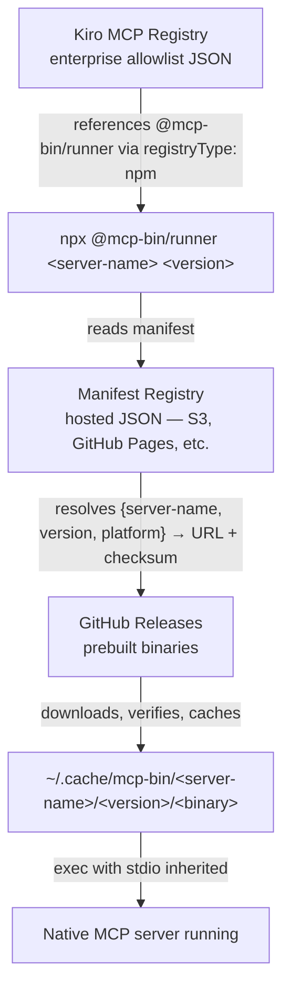

# mcp-bin — Requirements Specification

## Problem

Kiro's MCP registry supports distributing MCP servers via `npm`, `pypi`, and `oci` package runners. There is no distribution path for compiled Rust (or other native binary) MCP servers. Server authors must rely on manual installation (`install.sh`, `cargo install`, direct binary download) which doesn't integrate with the enterprise MCP registry allowlist or provide automatic versioning, caching, or platform detection.

- **Before**: Users must manually download, extract, chmod, and configure the binary path.
- **After**: Users add one JSON block to their config. The runner handles everything.

## Value Proposition

Ship your Rust (or any native binary) MCP server to any Kiro user with zero manual installation. One npx command. Automatic platform detection, SHA256 verification, and local caching.

## Goal

A generic npm-based runner that downloads, caches, and executes prebuilt native MCP server binaries. It plugs into Kiro's existing MCP registry infrastructure by using `registryType: "npm"`, requiring no changes to Kiro itself.

## Architecture



## Quickstart Example

### Server Author

You maintain `my-server` on GitHub with release binaries. Here's what you do:

1. Add your server to the manifest JSON:

   ```json
   {
     "schema_version": 1,
     "servers": {
       "my-server": {
         "1.0.0": {
           "darwin-arm64": {
             "url": "https://github.com/you/my-server/releases/download/v1.0.0/my-server-darwin-arm64.tar.gz",
             "sha256": "a1b2c3...",
             "binary_name": "my-server"
           },
           "linux-x64": {
             "url": "https://github.com/you/my-server/releases/download/v1.0.0/my-server-linux-x64.tar.gz",
             "sha256": "d4e5f6...",
             "binary_name": "my-server"
           }
         }
       }
     }
   }
   ```

2. Host the manifest at a public HTTPS URL (or submit to the default registry at `https://mcpregistry.wessells.io/manifest.json`).

### End User

A Kiro user adds your server to their agent config:

```json
{
  "mcpServers": {
    "my-server": {
      "command": "npx",
      "args": ["-y", "@mcp-bin/runner", "my-server", "1.0.0"]
    }
  }
}
```

First run downloads the binary (~5s). Subsequent runs use the cache (<100ms).

## Components

### 1. Runner (`@mcp-bin/runner`)

An npm package that acts as a shim between Kiro and native MCP server binaries.

#### Requirements

- R1: Accept server name and version as positional CLI arguments.
- R2: Detect the current platform (`darwin-arm64`, `linux-x64`, `linux-arm64`).
- R3: Fetch the manifest registry to resolve the download URL and SHA256 checksum for the given server, version, and platform.
- R4: Check the local cache (`~/.cache/mcp-bin/<server>/<version>/<binary>`) before downloading.
- R5: Download the binary archive from the resolved URL if not cached.
- R6: Verify the SHA256 checksum of the downloaded archive before extraction.
- R7: Extract the binary from the archive (`.tar.gz` format only).
- R8: Set the binary as executable (`chmod +x`) on Unix systems.
- R9: Exec the binary with stdio inherited (stdin/stdout/stderr pass through for MCP stdio transport).
- R10: Exit with the same exit code as the child process.
- R11: Print errors to stderr only (stdout is reserved for MCP protocol traffic).
- R12: Support `MCP_BIN_MANIFEST_URL` environment variable to override the default manifest location.
- R13: Support `MCP_BIN_CACHE_DIR` environment variable to override the default cache location.
- R14: Forward any additional arguments after server name and version to the binary.
- R15: Use atomic write semantics for cache population: download to a temporary file in the same directory as the final cache path, verify the SHA256 checksum of the archive, extract the binary, compute and store the binary's SHA256 in a sidecar file (`<binary>.sha256`), then atomically rename both files into the final cache path. Never write directly to the final path.
- R16: On cache hit, verify the cached binary's SHA256 against the sidecar `.sha256` file before execution. Re-download on mismatch or missing sidecar.
- R17: Use file-based locking (e.g., `<cache-path>.lock`) to prevent concurrent downloads of the same server+version by multiple processes. The lock file must contain the PID of the holding process. On lock acquisition failure, check if the PID is still alive; if not, break the stale lock. Wait up to 60 seconds for a held lock before failing. Locks older than 10 minutes are considered stale and may be broken.
- R18: Specify a connect timeout of 5 seconds and a response timeout of 30 seconds for manifest fetches. Specify a total download timeout of 5 minutes for binary downloads.
- R19: Retry transient failures (HTTP 5xx, TCP reset, TLS handshake timeout) with exponential backoff: 3 attempts with 1s/2s/4s delays. Do not retry 4xx errors.
- R20: Use `child_process.spawn` with stdio inherited. Forward SIGTERM and SIGINT to the child process and wait for the child to exit before exiting the runner. Exit with the child's exit code. During the download/verify phase, install signal handlers that clean up temporary files before exit. The runner must not write to stdout or stderr after spawning the child process.

#### Non-requirements

- NR1: The runner does not compile anything. It only downloads prebuilt binaries.
- NR2: The runner does not manage Rust toolchains or cargo.
- NR3: The runner does not auto-update. Version is explicit in the registry entry.
- NR4: Windows is not supported in v1. The platform schema allows adding `win32-x64` in a future version.

### 2. Manifest Registry

A JSON file that maps `{server, version, platform}` to a download URL and checksum.

#### Requirements

- R22: Hosted as a static JSON file over HTTPS (S3, GitHub Pages, any web server).
- R23: Schema:
  ```json
  {
    "schema_version": 1,
    "servers": {
      "<server-name>": {
        "<version>": {
          "<platform>": {
            "url": "https://...",
            "sha256": "abc123...",
            "binary_name": "local-memory-mcp"
          }
        }
      }
    }
  }
  ```
  Supported `<platform>` values: `darwin-arm64`, `linux-x64`, `linux-arm64`.
- R24: Platform identifiers use Node.js conventions: `darwin-arm64`, `linux-x64`, `linux-arm64`.
- R25: `binary_name` is optional. Defaults to the server name.
- R26: `url` points to a `.tar.gz` archive containing the binary.
- R27: `sha256` is the checksum of the archive file (not the extracted binary).
- R28: The manifest must include a top-level `"schema_version": 1` field. The runner must check this and fail if it encounters an unsupported version.
- R29: The runner must cache the manifest and its `.sig` file together as a pair with a 1-hour TTL. On fetch failure, fall back to the last-known-good cached manifest+signature pair with a warning to stderr. Signature verification applies to both fresh and cached manifests. If the `.sig` file cannot be fetched and no cached signature exists, exit 1 with a clear error. Never use a manifest without a corresponding verified signature.
- R30: The default manifest URL is `https://mcpregistry.wessells.io/manifest.json`. The `MCP_BIN_MANIFEST_URL` environment variable overrides this default.

#### Non-requirements

- NR5: The manifest does not need a database or API. It is a static file.
- NR6: The manifest does not handle authentication. If private, use S3 presigned URLs or a private web server.

### 3. Server Author Integration

How a Rust MCP server author registers their server in the manifest.

#### Requirements

- R31: Provide a shell script (`update-manifest.sh`) that updates the manifest JSON after a release.
- R32: Input: server name, version, GitHub Release URL base, SHA256SUMS file URL.
- R33: Output: updated manifest JSON with entries for all platforms found in the release.
- R34: The script should be idempotent — running it twice with the same input produces the same output.
- R35: A generic CLI tool or GitHub Action for third-party authors is deferred to a future version.

#### Example usage

```
./update-manifest.sh \
  --server local-memory-mcp \
  --version 0.2.1 \
  --release-url https://github.com/chriswessells/local-memory-mcp/releases/download/v0.2.1 \
  --checksums https://github.com/chriswessells/local-memory-mcp/releases/download/v0.2.1/SHA256SUMS.txt
```

### 4. Kiro MCP Registry Integration

How the runner appears in a Kiro enterprise MCP registry.

#### Requirements

- R36: Each server entry in the Kiro registry uses `registryType: "npm"` with `identifier: "@mcp-bin/runner"`.
- R37: Server name and version are passed via `packageArguments`.
- R38: Custom manifest URL (if not using the default) is passed via `environmentVariables`.
- R39: Example registry entry:
  ```json
  {
    "server": {
      "name": "local-memory-mcp",
      "description": "Local agent memory MCP server",
      "version": "0.2.1",
      "packages": [{
        "registryType": "npm",
        "identifier": "@mcp-bin/runner",
        "transport": { "type": "stdio" },
        "packageArguments": [
          { "type": "positional", "value": "local-memory-mcp" },
          { "type": "positional", "value": "0.2.1" }
        ],
        "environmentVariables": [
          { "name": "MCP_BIN_MANIFEST_URL", "value": "https://mcp-bin.example.com/manifest.json" }
        ]
      }]
    }
  }
  ```
- R40: The runner CLI interface (positional args, env vars) is a stable contract. Breaking changes require a major version bump. Registry entries should pin the runner version: `@mcp-bin/runner@1.x`.

### 5. Local Agent Config Integration

How the runner appears in a user's local `mcp.json` or agent config.

#### Requirements

- R41: Equivalent local config:
  ```json
  {
    "mcpServers": {
      "local-memory-mcp": {
        "command": "npx",
        "args": ["-y", "@mcp-bin/runner", "local-memory-mcp", "0.2.1"]
      }
    }
  }
  ```

## Security

- S1: All downloads must be over HTTPS.
- S2: SHA256 checksum verification is mandatory. Fail hard on mismatch.
- S3: The manifest URL must be HTTPS (or `file://` for local testing).
- S4: Downloaded archives are extracted to a user-scoped cache directory, not a system directory.
- S5: The runner must not execute anything other than the verified, extracted binary.
- S6: Temporary files must be cleaned up on failure.
- S7: The manifest must be signed. The runner must verify the signature before trusting any URL or checksum. The signing public key is pinned in the runner package. Signature format: detached Ed25519 signature file at `<manifest-url>.sig`.
- S8: Validate that `binary_name` in the manifest contains only alphanumeric characters, hyphens, and underscores. Reject values containing `/`, `\`, `..`, or null bytes.
- S9: During tar.gz extraction, validate that all extracted paths resolve within the target cache directory. Reject archives containing absolute paths, `..` components, or any symlinks.
- S10: Log a warning to stderr when using a non-default manifest URL via `MCP_BIN_MANIFEST_URL`.
- S11: Sanitize URLs in error messages — strip query parameters before printing to prevent credential leakage.
- S12: The runner must not forward sensitive environment variables (`AWS_*`, `GITHUB_TOKEN`, `*_SECRET`, `*_KEY`, `*_PASSWORD`) to the child process unless explicitly listed in the Kiro registry entry's `environmentVariables` array for that server (R38). The manifest schema does not control environment variable forwarding.

## Error Handling

- E1: Missing server in manifest → exit 1, stderr: "Server '<name>' not found in manifest"
- E2: Missing version → exit 1, stderr: "Version '<version>' of '<name>' not found"
- E3: Missing platform → exit 1, stderr: "No binary available for platform '<platform>'"
- E4: Download failure → exit 1, stderr: "Failed to download: <url>"
- E5: Checksum mismatch → exit 1, stderr: "Checksum verification failed for '<name>' v<version>"
- E6: Manifest fetch failure → exit 1, stderr: "Failed to fetch manifest: <url>"
- E7: All errors go to stderr. Stdout is never used for error output.
- E8: Download timeout → exit 1, stderr: "Download timed out after <N>s: <url>"
- E9: All retries exhausted → exit 1, stderr: "Failed after <N> retries: <url>"
- E10: Manifest signature verification failed → exit 1, stderr: "Manifest signature verification failed. The manifest may have been tampered with."
- E11: Invalid binary_name → exit 1, stderr: "Invalid binary name '<name>' in manifest — must contain only alphanumeric characters, hyphens, and underscores."
- E12: Archive path traversal detected → exit 1, stderr: "Archive contains unsafe paths. Extraction aborted."
- E13: Unsupported manifest schema version → exit 1, stderr: "Unsupported manifest schema version <N>. Please update @mcp-bin/runner."
- E14: Lock acquisition timeout → exit 1, stderr: "Timed out waiting for lock on '<server>' v<version>. Another process may be downloading."
- E15: Manifest signature file unavailable → exit 1, stderr: "Manifest signature file not found at <url>.sig"

## Testing

- T1: Unit tests for platform detection, cache path resolution, checksum verification.
- T2: Integration test: mock manifest + local file fixtures → runner downloads, caches, and execs a test binary.
- T3: Cache hit test: second run uses cache, no HTTP requests.
- T4: Checksum mismatch test: tampered archive is rejected.
- T5: Missing platform test: appropriate error message.
- T6: Atomic write test: concurrent invocations don't corrupt the cache.
- T7: Timeout test: stalled download is aborted within the specified timeout.
- T8: Path traversal test: malicious tar.gz with `..` paths is rejected.
- T9: Binary name validation test: invalid binary_name is rejected.
- T10: Stale lock test: lock from a dead PID is broken and download proceeds.
- T11: Sidecar checksum test: corrupted cached binary (mismatched `.sha256` sidecar) triggers re-download.

## Phase 2 — Planned

- P1: Distribute the runner as a standalone binary, removing the npm/npx dependency. This addresses the adoption barrier for users without Node.js.

## Future Considerations

- F1: Support `latest` as a version alias that resolves via the manifest.
- F2: Cache eviction policy (e.g., keep last N versions).
- F3: Support additional signing algorithms (GPG, cosign) beyond the Ed25519 baseline.
- F4: A `mcp-bin publish` CLI that server authors run in CI to update the manifest.
- F5: Support `--verbose` or `MCP_BIN_VERBOSE=1` for debug logging to stderr.
